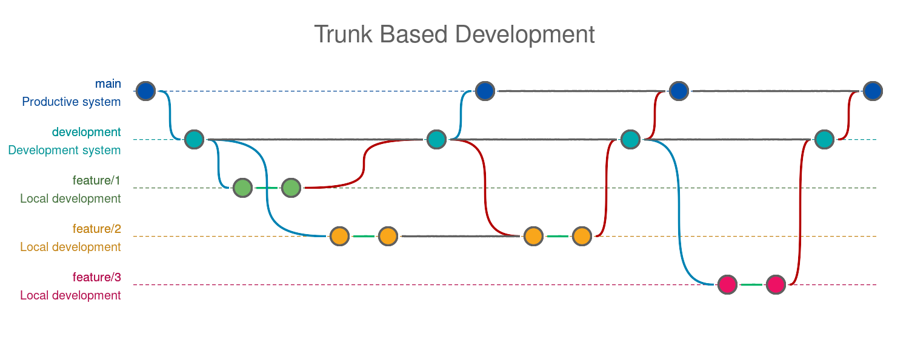

# PHPBranchDiagramBuilder

[](https://www.php.net/supported-versions.php)
[](https://packagist.org/packages/ixnode/php-branch-diagram-builder)
[](https://packagist.org/packages/ixnode/php-branch-diagram-builder)
[](https://phpstan.org/user-guide/rule-levels)
[](https://github.com/ixnode/php-vault/blob/master/LICENSE)

A library with which branching strategies can be made visible as an image through a config file and included in
documentation files such as README.md.

## Installation

```bash
$ composer require ixnode/php-branch-diagram-builder --dev
```

## Usage

Create a file called `.pbdb.yml` with the following content:

```yaml
title: Trunk Based Development
width: 1500
branches:
  - name: 'main'
    system: 'Productive system'
    color-light: '#0151ad'
    color-dark: '#024796'
  - name: 'development'
    system: 'Development system'
    color-light: '#01aaad'
    color-dark: '#029496'
  - name: ['feature', 1]
    system: 'Local development'
    color-light: '#70b964'
    color-dark: '#46733f'
  - name: ['feature', 2]
    system: 'Local development'
    color-light: '#f9a61b'
    color-dark: '#c48416'
  - name: ['feature', 3]
    system: 'Local development'
    color-light: '#ed1164'
    color-dark: '#b30c4c'
steps:
  - type: 'init'
    source: null
    target: 'main'
  - type: 'checkout'
    source: 'main'
    target: 'development'
  - type: 'checkout'
    source: 'development'
    target: ['feature', 1]
  - type: 'commit'
    source: ['feature', 1]
  - type: 'checkout'
    source: 'development'
    target: ['feature', 2]
  - type: 'commit'
    source: ['feature', 2]
  - type: 'merge'
    source: ['feature', 1]
    target: 'development'
  - type: 'checkout'
    source: 'development'
    target: 'main'
  - type: 'merge'
    source: 'development'
    target: ['feature', 2]
  - type: 'commit'
    source: ['feature', 2]
  - type: 'merge'
    source: ['feature', 2]
    target: 'development'
  - type: 'merge'
    source: 'development'
    target: 'main'
  - type: 'checkout'
    source: 'development'
    target: ['feature', 3]
  - type: 'commit'
    source: ['feature', 3]
  - type: 'merge'
    source: ['feature', 3]
    target: 'development'
  - type: 'merge'
    source: 'development'
    target: 'main'
```

Execute the following command:

```bash
$ vendor/bin/pbdb-builder build .pbdb.yml
```

It creates the following image:



This can be easily added to you README.md file:

```text

```

## A. Authors

* Björn Hempel <bjoern@hempel.li> - _Initial work_ - [https://github.com/bjoern-hempel](https://github.com/bjoern-hempel)

## B. License

This tutorial is licensed under the MIT License - see the [LICENSE.md](/LICENSE.md) file for details

## C. Closing words

Have fun! :)
